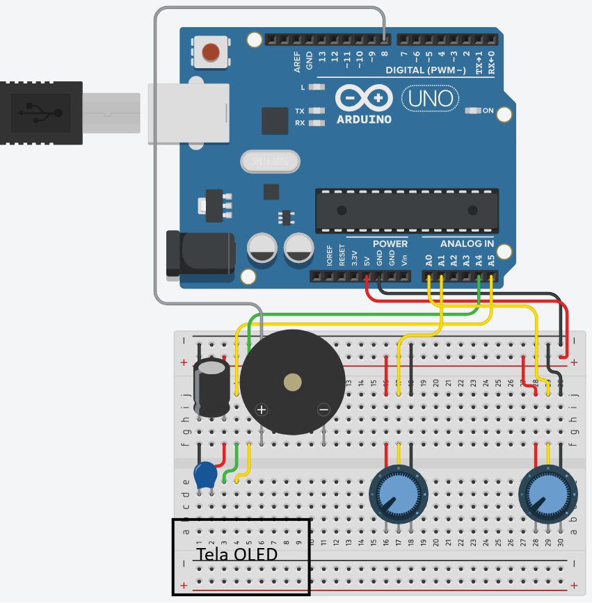
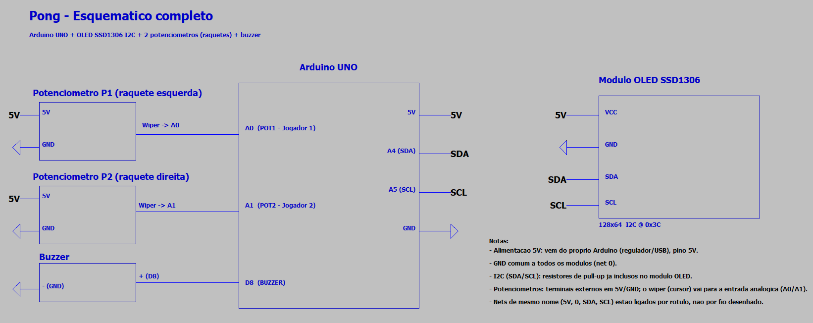
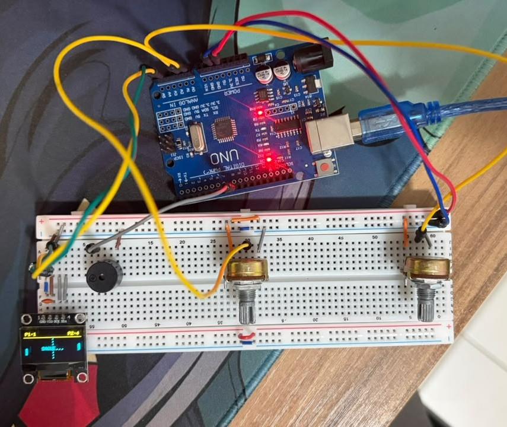
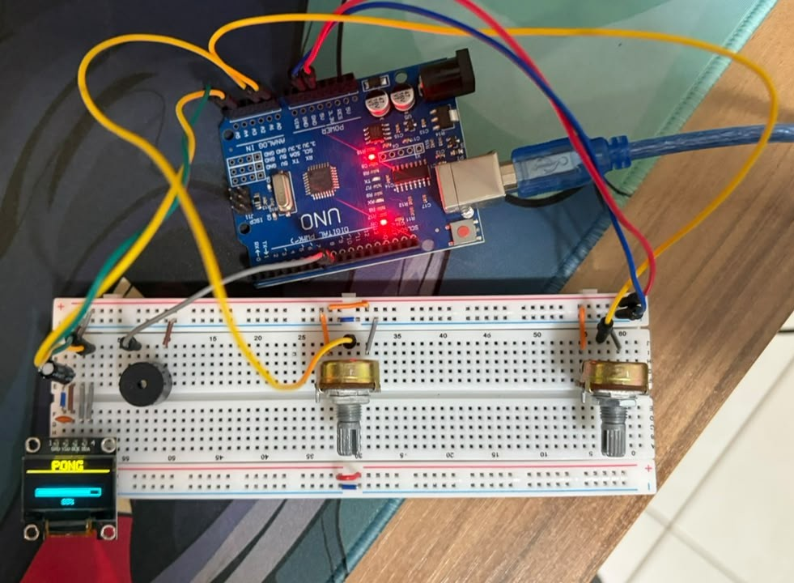

<div align="center">

# 🏓 Pong

**Jogo clássico de Pong para 2 jogadores na OLED 128x64, com raquetes controladas por potenciômetro e física de rebote com ângulo variável.**

[](https://www.arduino.cc/)
[](https://isocpp.org/)
[](https://choosealicense.com/licenses/mit/)

</div>

---

## Como funciona

0. **Loading (ao ligar)** — antes de qualquer partida, mostra o título "PONG" (confinado à faixa amarela do display) e, na faixa azul logo abaixo, uma barra de progresso enchendo de 0% a 100% ao longo de ~1,8s, com um bip a cada 25% e um bip final mais longo quando termina. Segue a mesma divisão visual do resto do jogo (header amarelo / conteúdo azul). Roda uma única vez no `setup()`, antes do primeiro saque.
1. **Saque** — a bola aparece parada no centro do campo por ~900ms (mensagem "SAQUE..." na tela) antes de cada rodada, dando tempo dos jogadores se posicionarem.
2. **Jogo** — cada jogador move sua raquete girando o próprio potenciômetro; a raquete acompanha a posição do potenciômetro com um filtro de suavização.
3. **Rebote com ângulo** — o ponto exato onde a bola acerta a raquete define o ângulo de saída (acertar na ponta da raquete devolve a bola bem inclinada; acertar no centro devolve quase reta). A bola também acelera um pouco a cada rebatida, até um limite máximo.
4. **Parede** — a bola quica no teto e no chão do campo de jogo (faixa azul da OLED).
5. **Ponto** — quando a bola passa por uma das raquetes, o adversário marca ponto, o buzzer toca um som de ponto, e uma nova bola é sacada na mesma direção (o jogador que tomou o ponto recebe o próximo saque).

---

## ⚙️ Componentes Utilizados

| Componente                      | Pino Arduino |
|----------------------------------|--------------|
| POT Jogador 1 (raquete esquerda) | A0           |
| POT Jogador 2 (raquete direita)  | A1           |
| Buzzer                            | D8           |
| OLED SDA                          | A4 (I2C)     |
| OLED SCL                          | A5 (I2C)     |

---

## Bibliotecas

- Adafruit SSD1306
- Adafruit GFX

---

## Layout / cores

Assume uma OLED SSD1306 "duas cores" (faixa amarela fixa em y=0–15, azul no resto — físico, não controlado por software). O placar (`P1:x` / `P2:x`) fica na faixa amarela; todo o campo de jogo (raquetes, bola, linha central pontilhada) começa em y=16, na faixa azul.

---

🖼️ Esquemático






---

## Destaques técnicos

- Tela de loading no boot: barra de progresso desenhada via `map()` do tempo decorrido (`millis()`) contra a duração total (`LOADING_DURACAO_MS`), com bipes de feedback a cada 25% — roda só uma vez em `setup()`, antes do `loop()` principal, então usar espera ativa (busy-wait) ali é seguro e não afeta o resto do jogo
- Loading segue a mesma divisão de cores do jogo: "PONG" em `setTextSize(2)` (16px de altura) cabe exatamente na faixa amarela (y=0–15), com a linha divisória em `HEADER_DIVIDER_Y`; a barra de progresso e o percentual ficam abaixo, na faixa azul — igual ao placar/campo de jogo do resto do minigame
- Física de colisão por AABB entre bola e raquete, com reflexo de ângulo variável baseado no ponto de impacto relativo ao centro da raquete
- Velocidade da bola aumenta a cada rebatida (até um teto), recomeçando do valor inicial a cada novo saque
- Leitura dos potenciômetros com filtro de suavização (evita "tremedeira" da raquete por ruído do ADC)
- Buzzer com `tone(pino, freq, duração)` — não bloqueia o `loop()`, cada som para sozinho
- Máquina de estados simples (Saque ↔ Jogando) 100% não-bloqueante com `millis()` dentro do `loop()`, sem `delay()`

## Estrutura

```
PongGame/
├── README.md
├── sketch_pong/
│   └── sketch_pong.ino
├── Esquemático/
│   └── Draft1.asc
└── circuit_images/
    └── .gitkeep
```

---

*Desenvolvido por Felipe Grolla*
